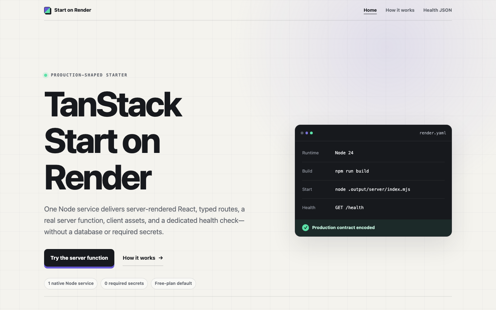

<h1 align="center">TanStack Start on Render</h1>

<p align="center">
  A small, production-minded TanStack Start SSR template for one native Render web service—without a database, Dockerfile, or required secrets.
</p>

<p align="center">
  <a href="https://render.com/docs/web-services"></a>
  <a href="https://tanstack.com/start/latest"></a>
  <a href="https://nodejs.org/"></a>
</p>

<p align="center">
  <a href="https://github.com/render-examples/tanstack-start/actions/workflows/ci.yml"></a>
  <a href="LICENSE"></a>
</p>

<p align="center">
  <a href="#how-it-runs">How it runs</a> ·
  <a href="#overview">Overview</a> ·
  <a href="#deploy-on-render">Deploy</a> ·
  <a href="#production-contract">Production contract</a> ·
  <a href="#development">Development</a> ·
  <a href="#operational-notes">Operations</a>
</p>

<p align="center">
  <a href="https://render.com/deploy?repo=https://github.com/render-examples/tanstack-start">
    
  </a>
</p>

## How it runs



`render.yaml` provisions one native Node web service. Render performs a frozen
npm install, Vite builds the client, SSR, and Nitro output, and the service runs
the generated entry directly with `node .output/server/index.mjs`.

At request time, Render's ingress forwards traffic to Nitro on
`0.0.0.0:$PORT`. The same process serves server-rendered TanStack Start routes,
hydrated client assets, same-origin server functions, and the dependency-free
`GET /health` response. The Blueprint configures the service; it is not part of
the HTTP request path.

## Overview

The demonstration is deliberately small, but every surface proves part of the
deployment contract that a real application needs.

<table>
  <tr>
    <td width="50%"><strong>Server-rendered pages</strong><br />The Nitro production build returns meaningful HTML before React hydrates.</td>
    <td width="50%"><strong>Typed navigation</strong><br />TanStack Router handles client navigation and direct server-rendered loads for <code>/about</code>.</td>
  </tr>
  <tr>
    <td width="50%"><strong>Read-only server function</strong><br />A same-origin request returns a timestamp created by the running server.</td>
    <td width="50%"><strong>One-service Render contract</strong><br /><code>render.yaml</code> declares the Node build, start command, host binding, and raw <code>/health</code> check.</td>
  </tr>
</table>

## Deploy on Render

You need a [Render account](https://render.com/register) with permission to
create a web service in the target workspace.

Local development needs no account. Deployment needs no additional
application-service account, database, secret, or setup value.

### 1. Review the Blueprint

Click **Deploy to Render** above. Render reads the root `render.yaml` and shows
one free native Node web service named `tanstack-start`. Review the proposed
resource before approving it.

### 2. Create the service

Approve the Blueprint in the intended Render workspace. The repository's
`.node-version` selects the exact Node runtime; the Blueprint declares the
frozen build, direct production entry, public host binding, and `/health`
check. It creates no database, disk, environment group, or secret.

The Blueprint sets `autoDeployTrigger: off`, following Render's guidance for
shared deploy-button repositories. A downstream owner can later enable
CI-gated auto-deploys for their own service.

### 3. Verify the first deploy

After the build completes, open the service URL and check:

1. `/health` returns `200` with `{"status":"ok"}`;
2. `/` renders the proof application;
3. **Check the server** returns a server timestamp; and
4. `/about` works both through the app link and after a direct reload.

The default Blueprint uses Render's Free instance. Free web services are for
testing and hobby use, [spin down after 15 minutes without inbound traffic, and
can take about a minute to wake](https://render.com/docs/free). Choose a paid
instance for production workloads that require consistent availability.

Free-instance hours, bandwidth, build-pipeline limits, and availability rules
can change. Treat [Render pricing](https://render.com/pricing) and the
[Free-instance documentation](https://render.com/docs/free) as the current
authority.

You can also create the service from **New → Blueprint** in the Render Dashboard
and select this repository; the root `render.yaml` is the Blueprint source.

### Start from your own repository

The button above deploys this canonical repository unchanged. To customize the
application, create a repository you control from this source, commit your
changes, give Render access to that repository, and create a Blueprint from its
root `render.yaml`.

## Production contract

| Concern | Repository contract | Source |
| --- | --- | --- |
| Runtime | Node 24.19.0, npm 11.17.0 | `.node-version`, `package.json` |
| Install and build | `npm ci --include=dev && npm run build` | `render.yaml` |
| Production entry | `node .output/server/index.mjs` | `render.yaml`, `package.json` |
| Network | `HOST=0.0.0.0`; Render supplies `PORT` | `render.yaml` |
| Health | `GET /health` → `200`, JSON, `Cache-Control: no-store` | `src/routes/health.ts` |
| Services | One free native Node web service | `render.yaml` |
| Required secrets | None | `render.yaml` |
| Auto-deploy | Off for deploy-button safety | `render.yaml` |

Render sets `NODE_ENV=production` for the native Node runtime. Do not hard-code
or override `PORT`; Nitro reads the value Render supplies.

## Development

The tested toolchain is Node 24.19.0 and npm 11.17.0. `.node-version` records
the exact Node release (which ships that npm release), `packageManager` records
the expected npm version, and `engines` declares the supported bounds. CI
enforces the exact pair; local npm engine checks remain advisory unless your
environment enables strict engine handling.

```sh
npm ci --include=dev
npm run dev
```

Vite starts the development server on `http://localhost:3000`.

### Verification

Build the canonical app before running its production checks. The disclosure
gate also builds its own disposable copy:

```sh
npm run quality
npm run typecheck
npm run build
npm run smoke:production
npm run validate:blueprint
npm run test:browser:install
npm run test:error-boundary
npm run test:browser
```

`validate:blueprint` downloads Render's current public JSON Schema, checks its
identity and draft, and applies this repository's exact one-service policy. It
needs network access but no Render credential. It is structural validation, not
a substitute for a maintainer-run fresh Render canary.

The disposable error-boundary gate builds a temporary copy with unique loader
and server-function failures. It proves that production responses keep the
generic 500 surface and metadata without disclosing either Error message or
source path, while retry, hydration, CSRF rejection, and 404 behavior remain
intact. It never adds a public failure route to the starter.

The browser journey uses one pinned Chromium release. It checks raw SSR,
hydration, typed navigation, the successful server function, cross-site CSRF
rejection, keyboard focus, 320-pixel reflow, the real 404 status, console
errors, and axe rules through WCAG 2.2 AA. See the
[manual accessibility checklist](docs/accessibility-checklist.md) for checks
automation cannot cover.

### Repository layout

```text
render.yaml                  One-service Render Blueprint
src/routes/                  SSR pages, app shell, and raw health route
src/start.ts                 Error serialization and server-function CSRF policy
src/server-demo.functions.ts Read-only server-function demonstration
scripts/                     Blueprint, production, and disclosure gates
tests/browser/               Chromium, CSRF, and accessibility journey
.github/workflows/ci.yml     Secret-free complete deployment-path gate
docs/accessibility-checklist.md Manual release checks beyond browser automation
```

### Make it yours

| Touchpoint | What to replace or review |
| --- | --- |
| `src/routes/index.tsx` | Home demonstration and SSR copy |
| `src/routes/about.tsx` | Secondary typed route |
| `src/server-demo.functions.ts` | Removable read-only server function |
| `src/routes/__root.tsx` | Shell, navigation, metadata, favicon, and 404 |
| `src/router.tsx` | Router settings and generic root error fallback |
| `src/start.ts` | Public Error serialization and explicit CSRF middleware |
| `src/styles.css` | Complete visual layer |
| `public/favicon.svg` | Transferable brand asset |
| `scripts/smoke-production.mjs` | Raw production-route and copy assertions |
| `scripts/check-error-boundary.mjs` | Disposable Error-disclosure and CSRF assertions |
| `tests/browser/app.spec.ts` | Hydration, RPC, navigation, security, reflow, 404, and axe assertions |

Keep the router, health route, production scripts, tests, and Blueprint as the
deployment foundation. `vite build` is the canonical route-tree generator;
review and commit any intentional change to `src/routeTree.gen.ts`. Do not add a
separate `tsr generate` step.

## Operational notes

- The starter writes no runtime data. Render service filesystems are ephemeral;
  add an external datastore or an appropriate paid persistent disk before
  introducing durable state.
- `src/start.ts` deliberately replaces serialized `Error` instances with a
  fixed public message and explicitly restores TanStack Start's same-origin
  CSRF middleware for server functions. Preserve both controls together and
  keep the hostile-origin browser check.
- Treat route-loader results as client-visible. Never place secrets in loader
  returns, client-importable module scope, or `VITE_*` variables; keep secret
  access inside per-request server-only code and name secret-bearing helpers
  with a `.server.ts` suffix.
- The Error adapter removes an `Error.message` from SSR and server-function
  payloads, but it is not a substitute for safe failures: thrown strings and
  plain objects can still serialize, isomorphic loader code can enter the
  client bundle, and server logs remain operator-visible. Throw `Error`,
  `Response`, redirect, or not-found values and never put secrets in thrown
  values or logs.
- The production process handles `SIGTERM`; the smoke test requires a clean,
  bounded shutdown so Render can replace instances safely.
- CI uses no secrets and grants its token only `contents: read`. It validates the
  repository contract, but only a fresh Render deployment can prove platform
  provisioning.

## Troubleshooting

| Symptom | Check |
| --- | --- |
| Node or npm differs locally or on Render | Compare `node --version` and `npm --version` with the production-contract table. A Render `NODE_VERSION` setting overrides `.node-version`. |
| `.output/server/index.mjs` is missing | Run `npm run build` before `npm start`, smoke, or browser checks. |
| Render cannot detect an open port | Keep `HOST=0.0.0.0` and let Render supply `PORT`. |
| The build cannot find Vite or Nitro | Use `npm ci --include=dev`; build tools are intentionally development dependencies. |
| The first free-instance request is slow | The service might be waking after its 15-minute idle spin-down. |
| A scripted server-function request returns 403 | Server functions are same-origin by default; use the hydrated app or send valid same-origin browser metadata. |
| A cross-site server-function probe stops returning 403 | Preserve the explicit filtered CSRF middleware in `src/start.ts`; a custom Start instance replaces the implicit default. |
| An internal error detail reaches the browser | Keep the public Error adapter and generic fallback in place. Normalize unknown thrown values to `Error`, and never place secrets in isomorphic loaders or thrown primitives/objects. |
| A commit does not deploy automatically | This is intentional: `autoDeployTrigger` is off. Use Render's manual deploy action or configure your downstream service deliberately. |
| A file written at runtime disappeared | Render's runtime filesystem is ephemeral. Use an appropriate external datastore or paid persistent disk for durable state. |
| Route types look stale | Run `npm run build`, review `src/routeTree.gen.ts`, and commit the generated change. |
| Playwright reports missing Linux libraries | Run `npm exec -- playwright install --with-deps chromium` once on that Linux host. |
| Blueprint validation fails after a schema update | Review Render's current schema and this repository's exact policy before changing either the Blueprint or validator. |

Primary references: [TanStack Start hosting](https://tanstack.com/start/latest/docs/framework/react/guide/hosting), [Render web services](https://render.com/docs/web-services), [Blueprints](https://render.com/docs/blueprint-spec), [Node versions](https://render.com/docs/node-version), and [health checks](https://render.com/docs/health-checks).

## Contributing

Read [CONTRIBUTING.md](CONTRIBUTING.md) before opening a pull request.

## License

Distributed under the [MIT License](LICENSE).
